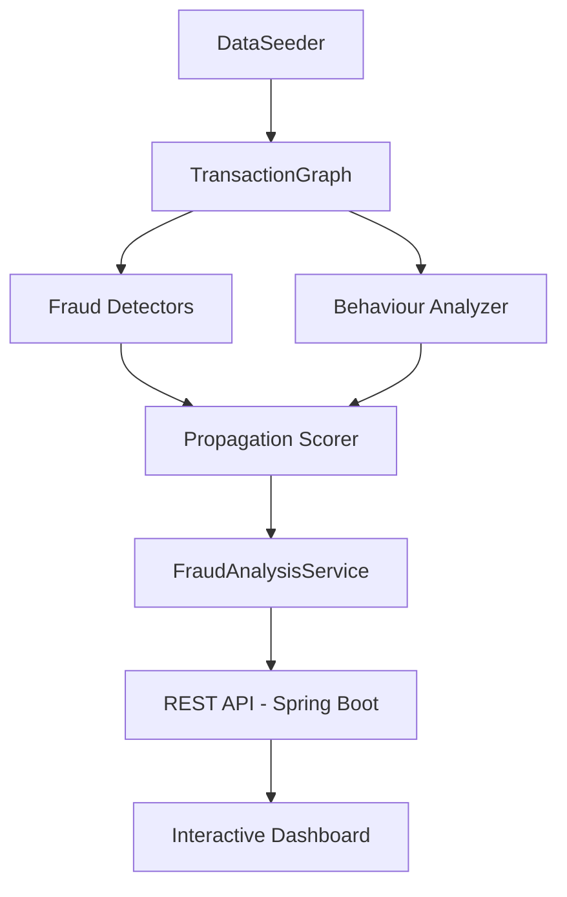

# FraudLens 🔍


**FraudLens** is an in-memory UPI transaction fraud detection and visualization engine. 

Instead of relying on heavy external graph databases, FraudLens implements a **custom in-memory graph engine** to detect complex money laundering patterns, identify mule accounts, and dynamically calculate account risk scores. The project includes a live-updating dashboard with an interactive network graph, allowing fraud analysts to visually trace illicit money flows.

## ❓ Why Graphs?
Fraud rarely exists in a single transaction. Instead, fraud emerges through relationships between accounts. 

Representing transactions as a directed graph allows classical graph algorithms like DFS and BFS to efficiently identify circular money laundering, hub accounts, layered transfers and network propagation.

## 🏛️ System Architecture



## ✨ Key Features

- **Interactive Network Visualization**: Physics-based graph rendering using Vis.js.
- **Custom Graph Engine**: Pure Java implementation of Directed Graphs, avoiding the overhead of external dependencies like Neo4j.
- **Live Dashboard**: Auto-refreshing metrics showing total transactions, accounts monitored, and active fraud alerts.
- **Algorithmic Threat Detection**: Employs classical computer science algorithms (DFS, BFS, Priority Queues, Sliding Windows) to detect specific fraud patterns.
- **Dynamic Risk Scoring**: An additive risk model (`Base Pattern Score + Propagation Bonus + Behaviour Bonus`) that categorizes accounts into `NORMAL`, `AT_RISK`, `SUSPICIOUS`, and `FRAUD`.
- **Realistic Data Simulation**: An automated `DataSeeder` that generates 100 accounts with distinct professions (Student, Salaried, Merchant), simulates organic lifestyle transactions, and injects sophisticated fraud topologies.

## 🧠 Algorithms & Detection Strategies

FraudLens relies on a suite of custom detectors:

| Pattern | Detection Strategy | Algorithm / Data Structure | Time Complexity |
| :--- | :--- | :--- | :--- |
| **Circular Laundering** | Detects funds moving in a closed loop (A → B → C → A) to obscure origin. | **Depth First Search (DFS)** + Recursion Stack | `O(V + E)` |
| **Hub Accounts** | Identifies central "mule" accounts with abnormally high connection degrees. | **Max-Heap (Priority Queue)** | `O(n log k)` |
| **Rapid Hops (Layering)** | Flags burst transactions where funds are rapidly hopped between accounts (e.g. 3+ txns in 5 mins). | **Sliding Window** (Two Pointers) | `O(n)` |
| **Structuring / Smurfing** | Detects multiple transactions intentionally kept just below reporting thresholds. | Grouping & Aggregation | `O(n)` |
| **Risk Propagation** | Contaminates accounts based on their proximity (degrees of separation) to known fraud nodes. | **Breadth First Search (BFS)** | `O(V + E)` |
| **Behaviour Analysis** | Penalizes deviations from a profile's expected max amount, monthly frequency, and active hours. | Statistical Profiling | `O(n)` |

## 📊 Risk Scoring Logic
The risk scoring follows an additive model:
`Final Risk Score = Base Pattern Score + Propagation Bonus + Behaviour Bonus`

- **Base Pattern**: Accounts directly involved in Hubs, Cycles, or Rapid Hops receive a high baseline score (e.g., 100 for a Cycle).
- **Propagation**: Accounts closely connected to flagged fraud nodes receive a propagation penalty calculated via BFS (closer proximity = higher penalty).
- **Behaviour**: Accounts deviating from their expected financial profile (e.g., abnormally high amounts, excessive frequencies, off-hours) receive additional penalties.

Scores are clamped between 0 and 100, dynamically categorizing accounts into 🟢 **NORMAL**, 🟡 **AT_RISK**, 🟠 **SUSPICIOUS**, or 🔴 **FRAUD**.

## 📐 Design Decisions
- **Custom In-Memory Graph**: Chose native Java collections (`HashMap`, `ArrayList`) to build a directed graph from scratch instead of Neo4j to ensure lightweight, zero-dependency deployment for demonstration and educational purposes.
- **Vanilla Frontend**: Used raw HTML, CSS Variables, and Vanilla JS over heavy SPA frameworks (React/Angular) to keep the project simple, highly performant, and easy to understand.
- **Decoupled Detectors**: Each fraud pattern (Cycle, Hub, Rapid Hop) is implemented as a standalone strategy class, making the system highly extensible for future rules.

## 🏗️ Project Structure
```text
src/
├── main/java/com/fraudlens/
│   ├── controller/      # REST API endpoints for the dashboard
│   ├── data/            # DataSeeder, Salary & Lifestyle Generators
│   ├── graph/           # Core Graph Engine, DFS/BFS Detectors, Propagation
│   ├── model/           # Account, Transaction, FraudAlert Data Models
│   └── service/         # FraudAnalysisService, BehaviourAnalyzer
└── main/resources/static/ # Frontend UI (HTML, CSS, Vanilla JS)
```

## 📂 Datasets
FraudLens uses a highly realistic, procedurally generated simulated dataset created on startup:
- **Accounts**: 100 accounts categorized by profession (Salaried, Student, Merchant).
- **Organic Traffic**: Simulates monthly salaries, peer-to-peer transfers, and lifestyle purchases.
- **Injected Fraud**: Hardcoded fraud topologies (cycles, hubs, rapid hops) are injected seamlessly without breaking realistic account balances.

## 🚀 Future Scope
- **Real-Time Transaction Monitoring** – Support live transaction streams instead of simulated data.
- **Explainable Risk Dashboard** – Display detailed evidence for each risk score (patterns, behaviour, propagation, and score breakdown).
- **Historical Behaviour Learning** – Learn user behaviour from previous transaction history instead of predefined profession-based profiles.
- **Configurable Fraud Detection Rules** – Allow thresholds (hub degree, rapid-hop window, transaction limits, etc.) to be modified from the dashboard.
- **Analyst Investigation Workflow** – Enable investigators to mark accounts as Fraud, False Positive, or Under Investigation and add investigation notes.

## ⚠️ Current Limitations
- Uses simulated UPI transaction data instead of real-time banking data.
- Behaviour analysis is based on predefined profession profiles, not historical account activity.
- Uses rule-based graph algorithms, so newly emerging fraud strategies may require additional detection rules.
- Stores data in-memory, making it suitable for demonstration and educational purposes rather than large-scale production deployment.

## 🛠️ Tech Stack

**Backend**
- **Java 17+**
- **Spring Boot** (Web, REST API)
- **Maven** (Build Tool)

**Frontend**
- **HTML5 & CSS3** (Vanilla, CSS Variables for Dark Theme)
- **JavaScript** (ES6+, Fetch API)
- **Vis.js** (Network Graph Rendering)

## 🚀 Getting Started

### Prerequisites
- Java Development Kit (JDK) 17 or higher
- Apache Maven

### Installation & Running

1. **Clone the repository** (or download the source):
   ```bash
   git clone https://github.com/yourusername/FraudLens.git
   cd FraudLens
   ```

2. **Compile and run the Spring Boot application**:
   ```bash
   mvn clean spring-boot:run
   ```

3. **Access the Dashboard**:
   Open your web browser and navigate to:
   ```text
   http://localhost:8080/fraudlens/
   ```

## 📄 License

This project is open-source and available under the [MIT License](LICENSE).
